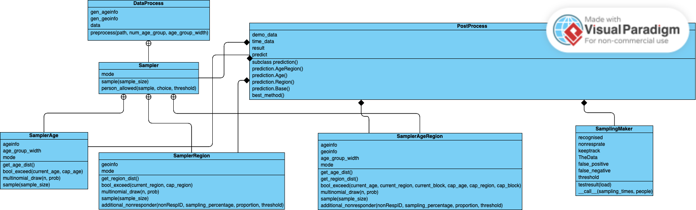

# EpiOS
[](https://github.com/SABS-R3-Epidemiology/EpiOS/actions/workflows/os_versions.yml)
[](https://github.com/SABS-R3-Epidemiology/EpiOS/actions/workflows/python_versions.yml)
[](https://github.com/SABS-R3-Epidemiology/EpiOS/actions/workflows/style.yml)
[](https://epios.readthedocs.io/en/latest/?badge=latest)
[](https://codecov.io/gh/SABS-R3-Epidemiology/EpiOS)

## General Information
This project consists different methods to sample the population and evaluation of different methods. We include a lot of situations that may cause bias to the estimate of infection level based on the sample, including non-responders, false positive/negative rate, the ability of transmission profile for patients during their period of infection. Based on the [EpiABM](https://github.com/SABS-R3-Epidemiology/epiabm) model, this package can also output the best sampling method by running simulations of disease transmission to see the prediction error of each sampling method.

## Installation

EpiOS is not yet available on [PyPI](https://pypi.org/), but the module can be pip installed locally. The directory should first be downloaded to your local machine, and can then be installed using the command:

```console
pip install -e .
```

We also recommend you to install the [EpiABM](https://github.com/SABS-R3-Epidemiology/epiabm) model to generate the data of infection simulation. You can firstly download the [pyEpiabm](https://github.com/SABS-R3-Epidemiology/epiabm/tree/main/pyEpiabm) to any location on your machine, and can then be installed using the command:

```console
pip install -e path/to/pyEpiabm
```

## Class Overview

 Here is a UML class diagram for our project:
 

## Configuration

 The `params.py` file include all parameters required in this model.

## Use `PostProcess` to generate plots

 Fistly, you need to define a new `PostProcess` object and input the demographical data `demodata` and infection data `timedata` generated from pyEpiabm.
 Secondly, you need to specify the sampling method you want to use, time points to sample and sample size. Here, we will use `AgeRegion` as sampling method, `[0, 1, 2, 3, 4, 5]` as time points to be sampled and `3` to be the sample size.
 Lastly, you can specify whether you want to consider non-responders and whether youwant to compare your results with the true data by specifying the parameter `non_responder` and `comparison`.
 
 For code example, you can see the following:

 ```console
 python
 ```

 ```python
 import epios
 postprocess = epios.PostProcess(time_data=timedata, demo_data=demodata, path='path/to/store/files/processed/during/sampling')
 kwargs = {
    'gen_plot': True,
    'saving_path_sampling': 'path/to/save/sampled/infection/rate',
    'saving_path_compare': 'path/to/save/comparison/plot'
 }
 res, diff = postprocess(sampling_method='AgeRegion', time_sample=[0, 1, 2, 3, 4, 5], sample_size=3, non_responders=False, comparison=True, **kwargs)
 ```

 Now, you will have your figure saved to the given path!
